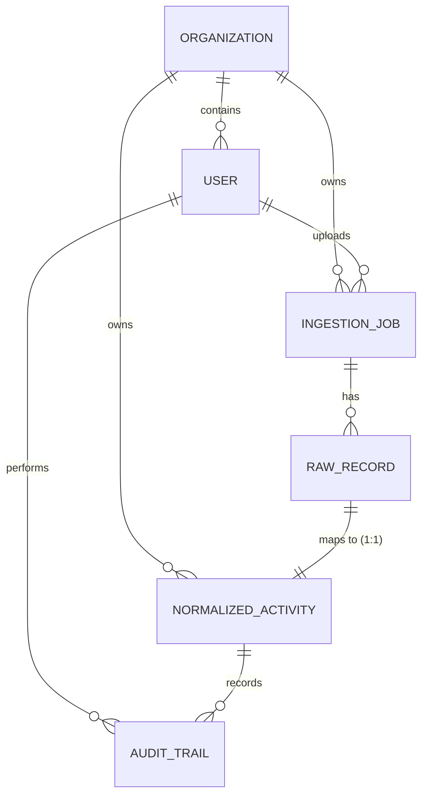

# Data Model Documentation (MODEL.md)

This document describes the relational database structure implemented in Django for the ESG Ingestion and Audit prototype.

## Database Schema (Relational Entity Design)

We designed a normalized relational database schema specifically optimized for multi-tenancy, audit integrity, and data lineage tracing.

### 1. Organization (`Organization`)
Supports absolute logical multi-tenancy. Every transaction, ingestion job, and activity belongs to an Organization.
- `id` (UUID, PK): Ensures unguessable URLs and ID spaces across tenants.
- `name` (CharField, Unique): Corporate name.
- `created_at` (DateTimeField): Inception date.

### 2. User (`User`)
Extends Django's `AbstractUser` to authenticate analysts and auditors.
- `id` (UUID, PK)
- `organization` (ForeignKey, nullable to allow global superusers, but scoped for regular analysts).

### 3. IngestionJob (`IngestionJob`)
Represents a source file upload transaction and acts as the entry point of truth.
- `id` (UUID, PK)
- `organization` (ForeignKey)
- `uploaded_by` (ForeignKey to User)
- `source_type` (CharField: `SAP` | `UTILITY` | `TRAVEL`)
- `filename` (CharField)
- `status` (CharField: `PENDING` | `PROCESSING` | `COMPLETED` | `FAILED`)
- `error_log` (TextField, optional): Captures file-level failures (e.g. malformed CSV structure).
- `raw_file_content` (TextField): A complete copy of the uploaded file, preserved in the database to guarantee source-of-truth immutability.
- `created_at` (DateTimeField)
- `completed_at` (DateTimeField)

### 4. RawRecord (`RawRecord`)
Stores individual lines/objects from the uploaded file in their raw representation before normalization.
- `id` (UUID, PK)
- `job` (ForeignKey to IngestionJob)
- `row_index` (IntegerField): The 1-based index (line number/object index) in the source file, enabling side-by-side traceback for auditors.
- `raw_data` (JSONField): The exact dictionary parsed from the source line.
- `status` (CharField: `UNPROCESSED` | `NORMALIZED` | `FLAGGED` | `ERROR`)
- `error_message` (TextField, optional): Line-level parsing and normalization exception.

### 5. NormalizedActivity (`NormalizedActivity`)
The normalized ledger record of corporate activity. 
- `id` (UUID, PK)
- `organization` (ForeignKey)
- `raw_record` (OneToOneField to RawRecord): Establishes strict 1-to-1 linkage, mapping the normalized ledger row directly back to its raw row source.
- `job` (ForeignKey to IngestionJob): Denormalized index for query speed.
- `activity_date` (DateField): The operational date representing the event.
- `activity_start_date` / `activity_end_date` (DateFields, optional): Billing period boundaries (essential for utility billing splits).
- `activity_category` (CharField): E.g., "Diesel Fuel", "Purchased Electricity", "Business Travel - Flights".
- `emissions_scope` (CharField: `SCOPE_1` | `SCOPE_2` | `SCOPE_3`)
- `raw_quantity` (DecimalField)
- `raw_unit` (CharField)
- `normalized_quantity` (DecimalField): Quantities normalized via the rules engine.
- `normalized_unit` (CharField): Unified unit representing the category (Liters, kWh, p-km, etc.).
- `review_state` (CharField: `INGESTED` | `FLAGGED` | `APPROVED` | `LOCKED`)
- `flags` (JSONField, default=[]): Array of warning strings generated by the heuristics engine (e.g., negative quantities, outliers).
- `reviewer` (ForeignKey to User, optional)
- `reviewed_at` (DateTimeField, optional)
- `locked_at` (DateTimeField, optional): Represents the timestamp of audit sealing.

### 6. AuditTrail (`AuditTrail`)
Preserves the complete change ledger.
- `id` (UUID, PK)
- `activity` (ForeignKey to NormalizedActivity)
- `user` (ForeignKey to User): The actor executing the change.
- `action` (CharField: `CREATE` | `EDIT` | `APPROVE` | `REJECT` | `LOCK`)
- `timestamp` (DateTimeField)
- `notes` (TextField): Analyst justification reasoning (required for edits).
- `changes` (JSONField, default={}): Stores the delta (e.g. `{"normalized_quantity": ["100", "120"]}`).

---

## Technical Design Choices & Rationales

### Absolute Immutability Enforcement
Sustainability ledger integrity is guaranteed by overriding Django model actions at the database adapter boundary (`models.py` clean/save/delete methods). Trying to delete or modify a record with `review_state == 'LOCKED'` throws a database exception, protecting the data regardless of the API path.

### Multi-Tenancy Boundary Isolation
To prevent cross-tenant data leaks, all queries in the API ViewSets override `get_queryset()` to partition by the logged-in user's organization (`organization=self.request.user.organization`).

### Direct Row Traceability
Rather than storing normalized data alone, storing the raw parsed data in `RawRecord` tied to the line index of the raw CSV file allows the UI to display side-by-side diff views. Auditors can trace from:
`NormalizedActivity` $\rightarrow$ `RawRecord` $\rightarrow$ `IngestionJob` (and its immutable `raw_file_content`).